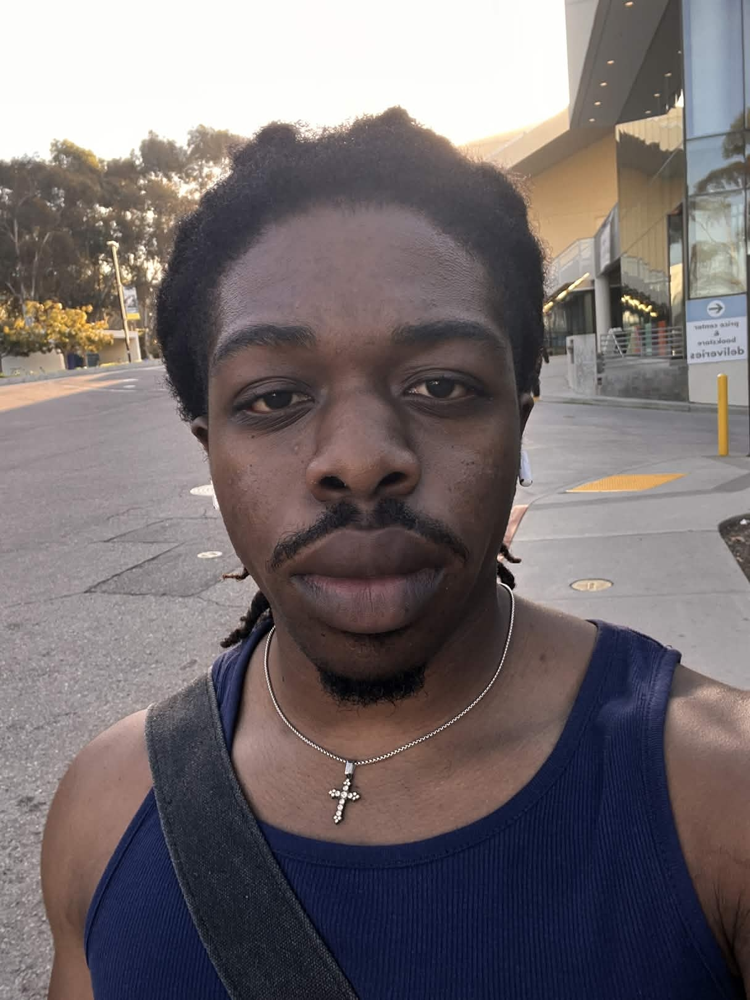
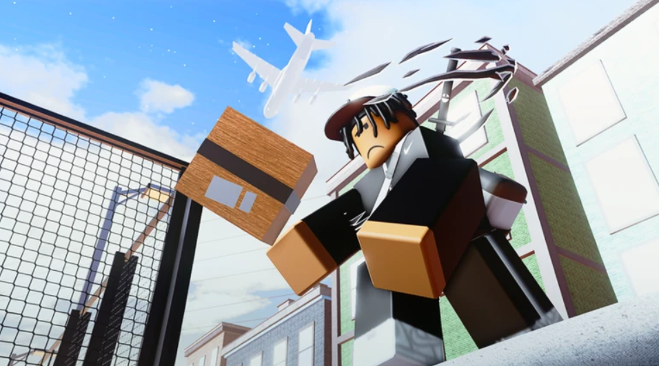
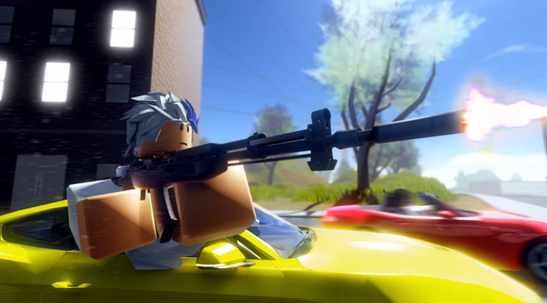
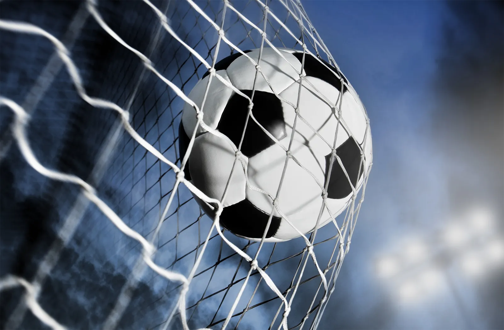

# Hello, I'm Ike Okoye!

[About Me](#about-me)  | [How I Got Into Programming](#how-i-got-into-programming) | [What I’m Into](#what-im-into)   | [Goals](#goals)
[Images](images)  

---

## About Me

Hey, I’m **Ike Okoye**.

I was born and raised in *Carson, California*, and I’m also Nigerian. I’m someone who’s really into both programming and creativity, so a lot of the things I enjoy fall somewhere between building, making, and expressing ideas.

> I like making things that feel personal, creative, and meaningful.




---

## How I Got Into Programming

I’ve been programming since **2020**. I first got into it during quarantine when my friends and I decided to try making a Roblox game together. That was really my introduction to coding, and from there I kept learning more because I liked how creative it felt, and I got good at it quickly.




> #### Game studio channel: [Studio channel](https://www.youtube.com/@fnsstudio4778)  


Programming was interesting to me right away because it felt like a mix of problem-solving and making something from nothing.


```python
name = "Ike Okoye"
started_programming = 2020

print(f"My name is {name} and I started programming in {started_programming}.")
```

## What I’m Into

I like making music, and I play both **piano** and **guitar**.


I’m also into pretty much anything art-related, like:

- film
- photography
- music
- fashion
- clothes
- books

A lot of what I enjoy comes from being creative and paying attention to style, expression, and storytelling.

Outside of that, I’m also really into **health and fitness**. I like staying active, and I enjoy playing sports too.



If I had to describe myself:

1. I’m creative
2. I like learning by doing
3. I care about self-improvement
4. I enjoy both tech and art

## Goals

Some things I want to keep growing in are:

- [x] becoming a better programmer
- [x] making more creative projects
- [x] improving as a musician
- [x] staying consistent with fitness
- [x] continuing to explore different kinds of art

### Closing

Thanks for reading my page! A lot of who I am is shaped by both creativity and curiosity, and I like bringing those things into whatever I do.

